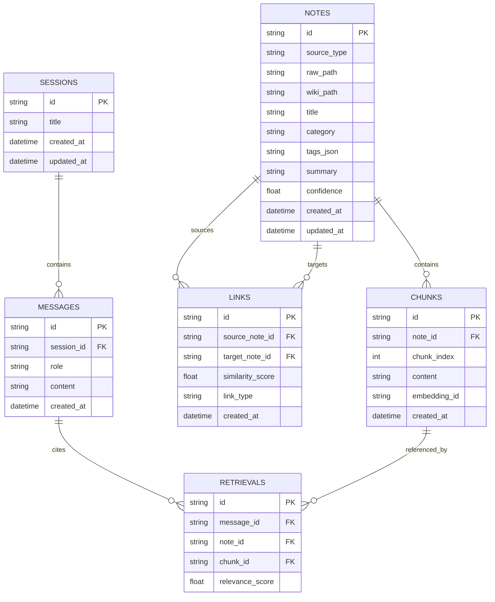
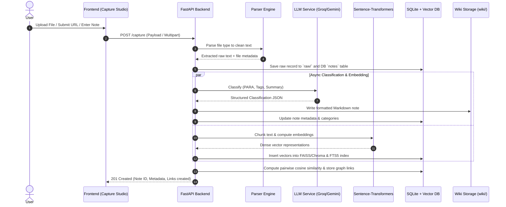
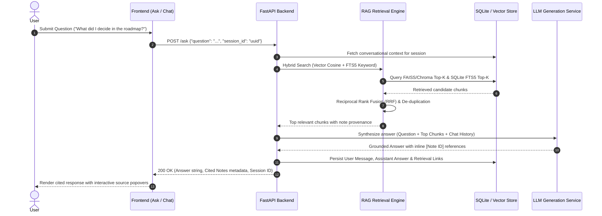
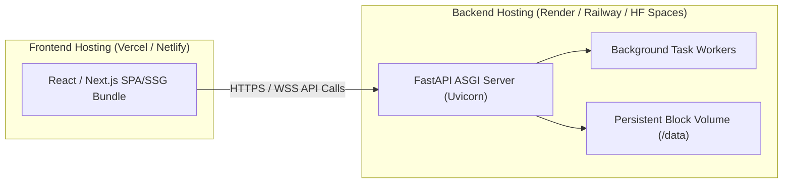

# Architecture Blueprint: SecondSelf — Multi-Modal AI Second Brain

**Document Version:** 1.0.0  
**Project:** SecondSelf (Web App Edition — National Hackathon Build)  
**Status:** Approved Technical Architecture  
**Target Platform:** Modern Web (React/Next.js) + Asynchronous Python Backend (FastAPI)

---

## 1. Executive Summary & Core Mission

**SecondSelf** is an intelligent, multi-modal personal knowledge management and retrieval-augmented generation (RAG) system. It addresses the fundamental flaw of conventional personal knowledge management (PKM) platforms—where knowledge capture is effortless but retrieval, structural linking, and active synthesis fail as data volume compounds.

SecondSelf ingests heterogeneous input modalities (PDFs, DOCX files, raw text notes, web bookmarks, screenshots/images, audio recordings, and tabular spreadsheets), normalizes them into a unified internal data abstraction, automatically classifies them using the **PARA framework** (Projects, Areas, Resources, Archives), constructs a multi-modal semantic knowledge graph, and delivers context-grounded, cited answers through a hybrid RAG pipeline with persistent multi-turn conversational memory.

```
Heterogeneous Ingestion (PDF, Audio, Image, DOCX, CSV, Web, Notes)
                           │
                           ▼
            Unified Schema Normalization Layer
                           │
             ┌─────────────┴─────────────┐
             ▼                           ▼
  PARA Classification (LLM)     Dense & Sparse Chunk Embeddings
             │                           │
             └─────────────┬─────────────┘
                           ▼
          Semantic Knowledge Graph Engine (Nodes & Edges)
                           │
             ┌─────────────┴─────────────┐
             ▼                           ▼
 Interactive Graph Explorer    Hybrid RAG Engine + Persistent Memory
 (vis-network / Cytoscape)         (FAISS / Chroma + SQLite FTS5)
```

---

## 2. High-Level System Architecture

SecondSelf follows a decoupled, service-oriented client-server architecture built for low-latency local execution, horizontal modularity, and pluggable AI providers.

```mermaid
graph TB
    subgraph Client ["Presentation Tier (Frontend - React / Next.js)"]
        UI_Shell["Navigation & Application Shell"]
        Capture_UI["Capture Studio (Multi-Modal Dropzone)"]
        Graph_UI["Knowledge Graph Explorer (Force-Directed)"]
        Ask_UI["Ask / Second Brain Q&A (Cited Chat Interface)"]
        History_UI["Conversation Memory & History Browser"]
    end

    subgraph API_Gateway ["Application Tier (FastAPI Async Gateway)"]
        Router["FastAPI REST Router / Middleware"]
        Auth_RateLimit["CORS, Rate Limiting & Health Handlers"]
    end

    subgraph Ingestion_Pipeline ["Ingestion & Normalization Engine"]
        PDF_Parser["PDF Parser (PyMuPDF + OCR Fallback)"]
        DOCX_Parser["DOCX Parser (python-docx)"]
        OCR_Engine["Image OCR & Vision Captioner"]
        ASR_Engine["Audio Transcriber (faster-whisper)"]
        Table_Parser["CSV/XLSX Structurer (pandas)"]
        Web_Scraper["Web Content Extractor (trafilatura)"]
        Normalizer["Schema Normalizer (UUID + Metadata + Raw Stash)"]
    end

    subgraph AI_Intelligence ["AI & ML Intelligence Tier"]
        Classifier["PARA Classifier (LLM Structured Output)"]
        Embedder["Embedding Generator (sentence-transformers)"]
        Linker["Auto-Linking Engine (Cosine Thresholding)"]
        Hybrid_Retriever["Hybrid Retriever (Dense Vector + FTS5)"]
        Reranker["Cross-Encoder / LLM Re-Ranker"]
        RAG_Synthesizer["RAG Synthesizer (Citation Mapping)"]
    end

    subgraph Storage_Tier ["Persistence & Data Tier"]
        Raw_FS["Raw Storage (raw/ - Original Files & Manifests)"]
        Wiki_FS["Wiki Vault (wiki/ - Formatted Markdown + Frontmatter)"]
        SQL_DB["SQLite RDBMS (Metadata, Links, Sessions, History)"]
        FTS_Index["SQLite FTS5 (Lexical / BM25 Search Index)"]
        Vector_DB["Vector Database (FAISS / ChromaDB)"]
    end

    %% Client to API
    Client -->|REST / JSON Payloads| Router
    Router --> Auth_RateLimit

    %% Ingestion Flow
    Router -->|File / Link / Note| Ingestion_Pipeline
    PDF_Parser & DOCX_Parser & OCR_Engine & ASR_Engine & Table_Parser & Web_Scraper --> Normalizer
    Normalizer --> Raw_FS
    Normalizer --> SQL_DB

    %% Intelligence Flow
    Normalizer -->|Extracted Text| Classifier
    Classifier --> Wiki_FS
    Classifier --> SQL_DB

    Normalizer -->|Chunked Text| Embedder
    Embedder --> Vector_DB
    Embedder --> Linker
    Linker --> SQL_DB

    %% Query / Ask Flow
    Router -->|User Prompt / Query| Hybrid_Retriever
    Hybrid_Retriever --> Vector_DB
    Hybrid_Retriever --> FTS_Index
    Hybrid_Retriever --> Reranker
    Reranker --> RAG_Synthesizer
    RAG_Synthesizer --> SQL_DB
    RAG_Synthesizer -->|Cited Answer + Context| Router

    %% Graph Flow
    Router -->|Fetch Graph Topology| SQL_DB
    SQL_DB --> Graph_UI
```



---

## 3. Subsystem Decomposition & Component Specifications

### 3.1 Presentation Layer (Frontend)

* **Framework:** React 18+ (Vite) or Next.js (App Router) using TypeScript.
* **Styling & Design System:** Custom Vanilla CSS Design System with dark-mode aesthetic, CSS variables for typography/hues, glassmorphism surfaces, smooth micro-interactions, and responsive grids.
* **Core Views:**
  1. **Capture Studio:** Drag-and-drop multi-file uploader, raw URL fetch bar, rich Markdown scratchpad, and real-time processing status toasts.
  2. **Knowledge Graph Explorer:** Canvas/WebGL force-directed graph view (`vis-network` or `Cytoscape.js`), offering real-time node clustering, PARA-coded and source-coded color palettes, link physics tuning, interactive node inspection cards, and sub-graph neighborhood filtering.
  3. **Ask / Second Brain Q&A:** Conversational streaming interface with markdown formatting, inline citation pills (`[Note 1]`, `[Doc: Meeting_Notes]`), clickable citation overlays displaying exact extracted chunk contexts, and source file view links.
  4. **Session History:** Multi-session conversation sidebar, full message tree inspection, previous retrieval chunk visualizers, and conversation branching/resumption.

### 3.2 Application & Routing Layer (Backend)

* **Framework:** Python 3.11+ with **FastAPI** utilizing asynchronous request handlers and Pydantic v2 validation models.
* **Primary REST Endpoints:**

| Method | Endpoint | Description | Input Payload / Params | Output Payload |
| :--- | :--- | :--- | :--- | :--- |
| `POST` | `/capture` | Ingests any supported file, link, or note | `multipart/form-data` or JSON | `CaptureResponse` (ID, status, normalized text snippet) |
| `POST` | `/classify` | Classifies note into PARA + generates tags | `{"note_id": "uuid"}` | `ClassificationResult` (category, tags, summary) |
| `POST` | `/link` | Computes semantic similarity and creates edges | `{"note_id": "uuid", "threshold": 0.70}` | `LinkResult` (linked_note_ids, scores) |
| `GET` | `/graph` | Retrieves graph topology (nodes + edges) | Optional filters (`category`, `source_type`) | `GraphData` (`nodes: []`, `edges: []`) |
| `POST` | `/ask` | Hybrid RAG Q&A with dynamic citations | `{"question": "str", "session_id": "uuid?"}` | `AnswerResponse` (answer, citations, session_id) |
| `GET` | `/history` | Lists all persisted chat sessions | Query pagination (`limit`, `offset`) | `List[SessionSummary]` |
| `GET` | `/history/{id}` | Retrieves complete session message thread | Path param `session_id` | `SessionDetail` (messages, retrievals) |
| `POST` | `/history/{id}/continue` | Appends follow-up question to existing session | `{"question": "str"}` | `AnswerResponse` |
| `GET` | `/health` | Liveness and readiness probe | None | `{"status": "healthy", "models_loaded": true}` |

---

## 4. Multi-Modal Ingestion & Normalization Engine

### 4.1 Parser Matrix & Extraction Strategies

```
┌─────────────────┬────────────────────────────┬────────────────────────────────────────────────────────┐
│ Source Type     │ Primary Extractor Engine   │ Fallback / Enrichment Strategy                         │
├─────────────────┼────────────────────────────┼────────────────────────────────────────────────────────┤
│ PDF Document    │ PyMuPDF (fitz)             │ Tesseract / PaddleOCR for scanned raster pages         │
│ DOCX Document   │ python-docx                │ Paragraph, heading, and table cell linearization       │
│ Image (PNG/JPG) │ Tesseract OCR / PaddleOCR  │ Vision LLM captioning (Groq LLaMA-Vision / Gemini)     │
│ Audio (MP3/WAV) │ faster-whisper / Whisper   │ Voice Activity Detection (silence culling)             │
│ CSV / Excel     │ pandas / openpyxl          │ Markdown table representation + column schema summary  │
│ Web URL         │ trafilatura                │ BeautifulSoup4 sanitization + metadata extraction      │
│ Plain Note      │ UTF-8 String Normalizer    │ Frontmatter extraction + title inference               │
└─────────────────┴────────────────────────────┴────────────────────────────────────────────────────────┘
```

### 4.2 Unified Ingestion Schema (`CaptureItem`)

Every capture is converted into an immutable standard record before downstream processing:

```json
{
  "id": "c7b8e1a2-9f3d-4c8e-b5a1-7e8d9c0a1b2c",
  "timestamp": "2026-09-18T07:52:00.000Z",
  "source_type": "pdf",
  "raw_path": "raw/c7b8e1a2-9f3d-4c8e-b5a1-7e8d9c0a1b2c.pdf",
  "extracted_text": "Quarterly Technical Strategy & Roadmap...",
  "metadata": {
    "original_filename": "Q3_Roadmap.pdf",
    "mime_type": "application/pdf",
    "file_size_bytes": 1048576,
    "page_count": 14,
    "sha256_hash": "e3b0c44298fc1c149afbf4c8996fb92427ae41e4649b934ca495991b7852b855"
  }
}
```

---

## 5. AI/ML Pipeline & Intelligence Architecture

### 5.1 PARA Classification & Metadata Synthesis

Extracted text is processed by an LLM with strict JSON schema enforcement:

```
[Extracted Text] ───► [LLM Structured Parser] ───► {
                                                     "category": "Projects | Areas | Resources | Archives",
                                                     "tags": ["architecture", "rag", "fastapi"],
                                                     "summary": "One-line operational summary.",
                                                     "confidence": 0.94
                                                   }
```

* **Primary Engine:** Groq API (`llama-3.1-70b-versatile` / `llama-3.1-8b-instant`) for sub-second inference.
* **Fallback Strategy:** Cloud LLM (Gemini 1.5 Flash / OpenAI GPT-4o-mini) or rule-based keyword/regex classifier in offline mode.

### 5.2 Text Chunking & Embeddings

* **Chunking Strategy:** Recursive Character/Token Splitter.
  * Chunk size: $500 - 800$ tokens.
  * Overlap: $15\%$ ($75 - 120$ tokens).
  * Chunk Metadata: `{ "chunk_id": "uuid", "parent_note_id": "uuid", "chunk_index": 0, "source_type": "pdf" }`.
* **Embedding Model:** `sentence-transformers/all-MiniLM-L6-v2` (384-dimensional dense vectors) or `BAAI/bge-small-en-v1.5` executing locally on CPU/GPU.

### 5.3 Knowledge Graph & Semantic Auto-Linking

1. For every newly ingested note $N_{new}$, compute its global document embedding vector $\vec{v}_{new}$.
2. Perform a cosine similarity query against all active notes $\{N_1, N_2, \dots, N_k\}$ in the vector index:
   $$\text{Cosine Similarity}(u, v) = \frac{\vec{u} \cdot \vec{v}}{\|\vec{u}\| \|\vec{v}\|}$$
3. Establish bidirectional semantic edges if $\text{Similarity} \ge \tau$ (Default threshold $\tau = 0.70$).
4. **Hub Explosion Prevention:** Cap maximum auto-generated edges per node at top-$K$ ($K = 5$), deduplicate mutual links, and preserve link weight metadata for graph physics rendering.

### 5.4 Hybrid Retrieval-Augmented Generation (RAG) & Citation Engine

```
[User Question]
       │
       ├─────────────────────────────────┬─────────────────────────────────┐
       ▼                                 ▼                                 ▼
[Query Embeddings]               [FTS5 BM25 Lexical]             [Past Chat Context]
       │                                 │                                 │
       ▼                                 ▼                                 │
[FAISS / Chroma Vector Top-K]    [SQLite FTS5 Text Top-K]                  │
       │                                 │                                 │
       └────────────────┬────────────────┘                                 │
                        ▼                                                  │
          [Reciprocal Rank Fusion (RRF)]                                   │
                        │                                                  │
                        ▼                                                  │
          [Top N Re-Ranked Chunks]                                         │
                        │                                                  │
                        └────────────────┬─────────────────────────────────┘
                                         ▼
                             [LLM Context Synthesizer]
                                         │
                                         ▼
                  [Answer with Structured Citations: [Note ID]]
```

* **Hybrid Retrieval:** Merges semantic dense retrieval (FAISS/Chroma) and sparse keyword retrieval (SQLite FTS5) via Reciprocal Rank Fusion (RRF):
  $$RRF(d) = \sum_{m \in M} \frac{1}{60 + r_m(d)}$$
* **Grounding & Faithfulness Guardrail:** System prompt enforces strict provenance: *"Answer strictly and exclusively using the retrieved context chunks. Never fabricate facts. For each factual assertion, append the corresponding `[Note: <id>]` citation."*

---

## 6. Storage & Database Schema Design

### 6.1 Relational Database Model (SQLite)



### 6.2 File System Architecture

```
secondself/
├── raw/                                  # Immutable raw ingested assets
│   ├── c7b8e1a2-9f3d-4c8e-b5a1.pdf       # Original binary/text files
│   └── c7b8e1a2-9f3d-4c8e-b5a1.json      # Ingestion manifest & metadata
├── wiki/                                 # Living knowledge base (Markdown)
│   ├── Projects/
│   │   └── Project_Alpha.md              # Markdown with YAML Frontmatter
│   ├── Areas/
│   ├── Resources/
│   └── Archives/
└── backend/db/
    ├── secondself.db                     # SQLite Database (Metadata + FTS5)
    └── vector_store/                     # FAISS Index / ChromaDB files
```

---

## 7. Data Flow & Sequence Diagrams

### 7.1 Capture & Knowledge Assimilation Pipeline



### 7.2 Multi-Turn Cited RAG Query Execution



---

## 8. Non-Functional Requirements & Performance Targets

| Quality Dimension | Metric / Target | Implementation Strategy |
| :--- | :--- | :--- |
| **Query Latency** | p95 $< 8.0\text{s}$ for full `/ask` | Streaming response support; fast inference via Groq; local embedding computation ($< 150\text{ms}$). |
| **Graph Rendering** | $< 2.0\text{s}$ for $100+$ nodes | Physics stabilization offloading; lazy-loading node metadata; canvas/WebGL acceleration. |
| **Ingestion Throughput** | $< 3.0\text{s}$ for typical PDF / Audio | Asynchronous background workers; PyMuPDF C-bindings; `faster-whisper` quantized int8 inference. |
| **Fault Tolerance** | Zero data loss on API crashes | Two-phase write: raw source stashed immediately to `raw/` before triggering AI extraction pipeline. |
| **Cost Efficiency** | $< \$0.01$ per capture/query | Local open-source embeddings (`all-MiniLM-L6-v2`) + free-tier LLMs (Groq LLaMA-3 / Gemini Flash). |
| **Privacy & Security** | Local-first design | Raw data stored locally; no external training; stripped metadata logs; sanitized HTML parsing. |

---

## 9. Error Handling & Edge Case Strategy

```
┌──────────────────────────┬─────────────────────────────────┬──────────────────────────────────────────┐
│ Failure Mode             │ Root Cause                      │ Architectural Recovery Mechanism         │
├──────────────────────────┼─────────────────────────────────┼──────────────────────────────────────────┤
│ LLM Rate Limit / Timeout │ API exhaustion on primary LLM   │ Exponential backoff + automatic fallback │
│                          │                                 │ to secondary provider (Gemini / Local)   │
├──────────────────────────┼─────────────────────────────────┼──────────────────────────────────────────┤
│ Scanned / Empty PDF      │ PDF contains bitmap images only │ Automatic fallback trigger to OCR engine │
│                          │                                 │ (Tesseract/PaddleOCR) on zero-text output│
├──────────────────────────┼─────────────────────────────────┼──────────────────────────────────────────┤
│ Silent / Corrupt Audio   │ Microphone error or empty audio │ Energy/VAD pre-check; flag as            │
│                          │                                 │ "empty_audio" without halting queue      │
├──────────────────────────┼─────────────────────────────────┼──────────────────────────────────────────┤
│ Massive Document         │ 100+ page PDF or huge CSV       │ Async chunked streaming processing;      │
│                          │                                 │ parent-child chunk indexing              │
├──────────────────────────┼─────────────────────────────────┼──────────────────────────────────────────┤
│ Duplicate Ingestion      │ Identical file uploaded twice   │ SHA-256 fingerprint check on upload;     │
│                          │                                 │ prompts user or merges link graph nodes  │
├──────────────────────────┼─────────────────────────────────┼──────────────────────────────────────────┤
│ Graph Over-Connectivity  │ Universal stop-words linking    │ Max degree cap ($K=5$); minimum cosine   │
│                          │ every node to every node        │ threshold ($\tau \ge 0.70$); edge pruning│
└──────────────────────────┴─────────────────────────────────┴──────────────────────────────────────────┘
```

---

## 10. Deployment & Infrastructure Architecture



* **Frontend:** Hosted on Vercel or Netlify via CI/CD pipeline connecting to the repository.
* **Backend:** Containerized via Docker (`Dockerfile` bundling Python 3.11, ffmpeg, tesseract-ocr) hosted on Render, Railway, or Hugging Face Spaces.
* **Storage Volume:** Persistent mount attached to container at `/app/data` holding `raw/`, `wiki/`, and SQLite databases.
* **Environment Configuration:** Secure environment variable management for API keys (`GROQ_API_KEY`, `GEMINI_API_KEY`, `OPENAI_API_KEY`).

---

## 11. Project Directory & Module Layout

```
secondself/
├── backend/
│   ├── main.py                   # FastAPI Application Entrypoint & CORS setup
│   ├── config.py                 # Configuration & Environment Variables
│   ├── capture.py                # Ingestion router & orchestration
│   ├── parsers/                  # Dedicated multi-modal file parsers
│   │   ├── __init__.py
│   │   ├── pdf_parser.py         # PyMuPDF + OCR fallback
│   │   ├── docx_parser.py        # python-docx parser
│   │   ├── image_ocr.py          # Tesseract / PaddleOCR & Vision
│   │   ├── audio_transcribe.py   # faster-whisper transcription
│   │   ├── csv_parser.py         # pandas / openpyxl summarizer
│   │   └── link_extractor.py     # trafilatura / BeautifulSoup
│   ├── classify.py               # PARA LLM classification engine
│   ├── link.py                   # Embedding generation & auto-linking
│   ├── build_graph.py            # Graph topology builder & serializer
│   ├── ask.py                    # Hybrid RAG & citation engine
│   ├── history.py                # Conversational session management
│   ├── db/
│   │   ├── database.py           # SQLite connection & sessionmaker
│   │   ├── models.py             # SQLAlchemy ORM models
│   │   └── vector_store.py       # FAISS / ChromaDB abstraction layer
│   └── requirements.txt          # Backend dependencies
├── frontend/
│   ├── src/
│   │   ├── App.tsx               # Primary layout & routing shell
│   │   ├── main.tsx              # Application entrypoint
│   │   ├── pages/
│   │   │   ├── CapturePage.tsx   # Multi-modal capture studio
│   │   │   ├── GraphPage.tsx     # Force-directed visual graph
│   │   │   ├── AskPage.tsx       # Second brain Q&A interface
│   │   │   └── HistoryPage.tsx   # Session memory browser
│   │   ├── components/
│   │   │   ├── GraphView.tsx     # vis-network / Cytoscape wrapper
│   │   │   ├── ChatBox.tsx       # Message thread with inline citations
│   │   │   ├── CitationCard.tsx  # Interactive source reference preview
│   │   │   └── Dropzone.tsx      # File & URL ingestion component
│   │   └── styles/
│   │       ├── index.css         # Global tokens, typography, dark theme
│   │       └── components.css    # Component-level styling
│   ├── package.json              # Frontend dependencies & scripts
│   └── vite.config.ts            # Vite bundler configuration
├── raw/                          # Raw ingested data artifacts
├── wiki/                         # Organized PARA knowledge vault
├── Dockerfile                    # Containerization specification
├── docker-compose.yml            # Local orchestration
└── README.md                     # Setup, architecture & usage guide
```
