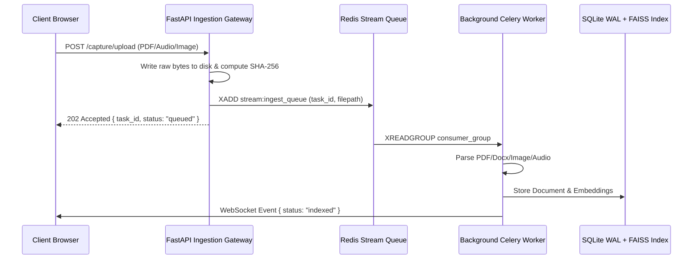

# RFC-042: Event-Driven Async Processing Pipeline Architecture

**Status:** Approved  
**Author:** Lead Backend Architect  
**Target Delivery:** 2026-Q3  
**Components:** Redis Streams, RabbitMQ, Celery Worker Fleet, FastAPI Gateway

## 1. Problem Statement
Currently, document ingestion and OCR extraction operate synchronously on API worker threads. When users upload multi-page PDFs or high-resolution images, HTTP requests block for 4-12 seconds, exhausting ASGI worker pools and triggering HTTP 504 Gateway Timeouts under burst load.

## 2. Proposed Architecture
We will decouple ingestion into a two-phase async pipeline:
1. **Phase 1 (Stash & Acknowledge):** Ingest raw binary directly to disk/object store (`/raw/<uuid>.<ext>`), compute SHA-256 checksum, record metadata in SQLite, and immediately return HTTP 202 Accepted with a task UUID.
2. **Phase 2 (Async Worker Consumption):** Push message to Redis Stream `stream:ingest_queue`. Worker daemon pulls messages, executes PyMuPDF / Tesseract OCR / Whisper transcription, generates vector embeddings, and writes to FAISS index.

## 3. Key Configurations & Timeouts
- **Max Payload Size:** 50MB per file
- **Stream Max Length:** `MAXLEN ~ 10,000`
- **Worker Concurrency:** 4 processes per worker container
- **Failure Handling:** Dead-Letter Queue `stream:ingest_dlq` after 3 failed retries with exponential backoff.
